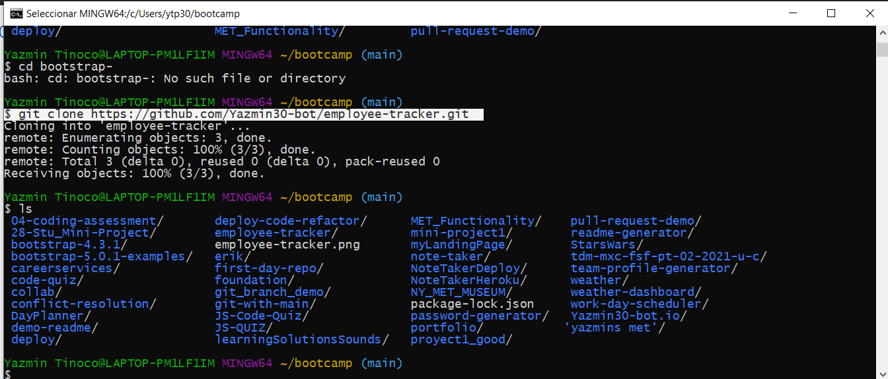
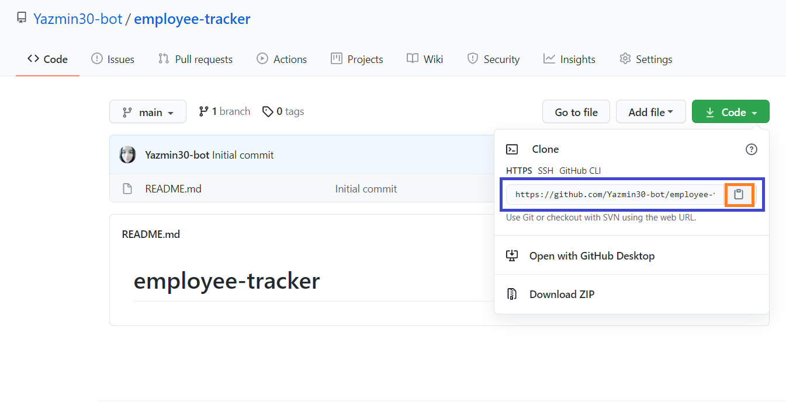
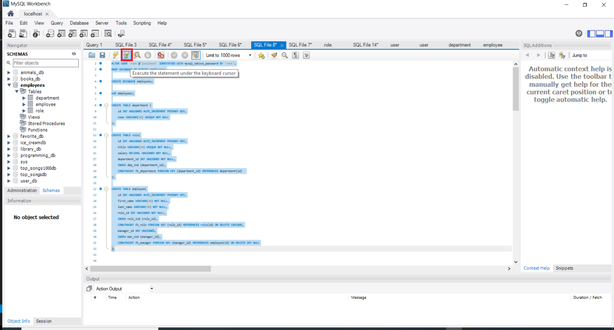
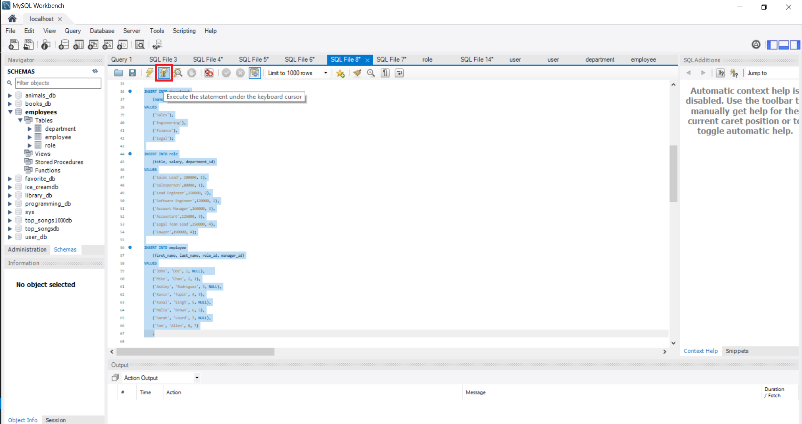
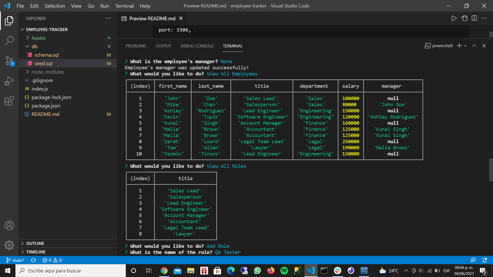

# Employee Tracker


## Description
  
  Create an application for managing a company's employees. 
  * Uses the [MySQL](https://www.npmjs.com/package/mysql).

  * Uses the [InquirerJs](https://www.npmjs.com/package/inquirer/v/0.2.3).

  * Uses the [console.table](https://www.npmjs.com/package/console.table).

  
  
## Table of Contents
  
  *[Installation](#installation)
  
  *[Usage](#usage)
  
  *[Build-With](#build-with)

  *[Links](#links)

  *[Author](#author)
  
  *[Contributing](#contributing)
  
  *[Questions](#questions)

## Installation
  * Go to the following link [https://github.com/Yazmin30-bot/employee-tracker](https://github.com/Yazmin30-bot/employee-tracker/) and clone it 
  * Go to Git-bash and page the github's with the following code
    ```
    $ git clone https://github.com/Yazmin30-bot/employee-tracker.git
    ``` 
    
  * When you first set up the project before installing any dependencies, make sure that your repo includes a package.json with the required dependencies. You can create one by running 
    ```
    npm init
  
    ``` 
  * For this project is needed to add the following dependencies to package.json file  
    ```
        "dependencies": {
            "asciiart-logo": "^0.2.6",
            "console.table": "^0.10.0",
            "inquirer": "^6.2.1",
            "mysql": "^2.16.0"
        }
    ``` 
    

  * To install necessary dependencies, run the following command:
    ```
    npm install
    npm install asciiart-logo
    npm install console.table
    npm install inquirer
    npm install mysql
    ```
## Usage
  * Create the database using the schema.sql and seeds.sql files on MySQL Workbench
    
    

  * The application will be invoked by using the following command:

    ```bash
    node index.js
    ```
  * The following image demonstrates the application functionality, Also you can find the video on the links section:  
    

  * If you have and error, make sure that the following info are correct with your own data on the index.js file
      ```bash
      host: 'localhost',

      // Your port, if not 3306
      port: 3306,

      // Your username
      user: 'root',

      // Be sure to update with your own MySQL password!
      password: 'root',
      database: 'employees',
    ``` 
    or you can use the next code and add it before to create the database on MySQL Workbench

    ```bash
    ALTER USER 'root'@'localhost' IDENTIFIED WITH mysql_native_password BY 'root';
    ```   


## Build with 
  * [Javascript](https://www.javascript.com/) - `Javascript`
  * [NodeJs](https://nodejs.org/en/) - `NodeJs`
  * [MySQL](https://www.mysql.com/) - `MySQL`


## Links
  * The Video of the deployed application. PART I
  [https://drive.google.com/file/d/1Z6LYlwdXzVeVXSI7YSc3yYL1yOB39B_q/view?usp=sharing/](https://drive.google.com/file/d/1Z6LYlwdXzVeVXSI7YSc3yYL1yOB39B_q/view?usp=sharing/)

  * The Video of the deployed application. PART II
  [https://drive.google.com/file/d/1kKwheb55u2VSnJiNAls7rBuHQ0K6SrbV/view?usp=sharing/](https://drive.google.com/file/d/1kKwheb55u2VSnJiNAls7rBuHQ0K6SrbV/view?usp=sharing/)

  * The URL of the GitHub repository.                                         [https://github.com/Yazmin30-bot/employee-tracker/](https://github.com/Yazmin30-bot/employee-tracker/)

## Author 
  * **`Yazmin Tinoco`**   - [Yazmin30-bot](https://github.com/Yazmin30-bot/)

## Contributing
  Pull requests are welcome. For major changes, please open an issue first to discuss what you would like to change. 


  
## Questions
  If you have any questions about the repo, open an issue or contact me directly at ytip30@gmail.com.
  You can find more of my work at [Yazmin30-bot](https://github.com/Yazmin30-bot/).  


